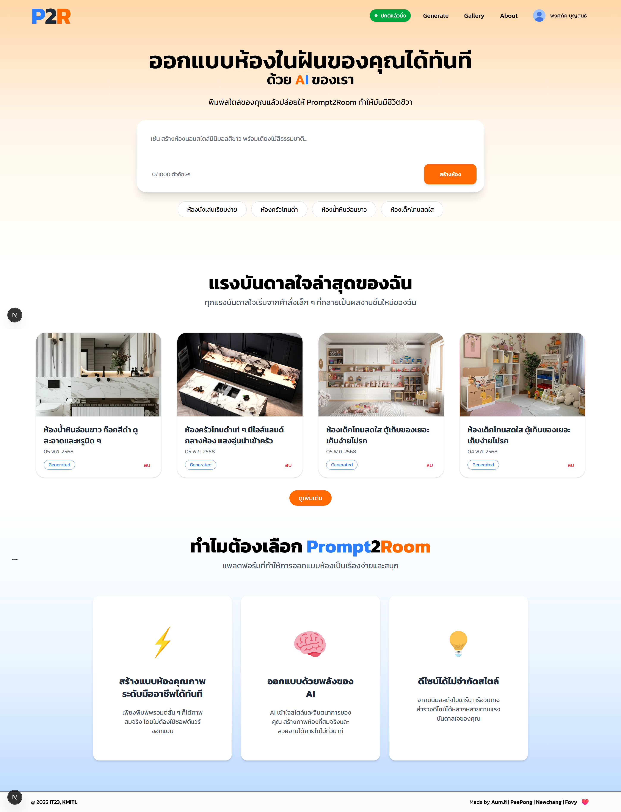
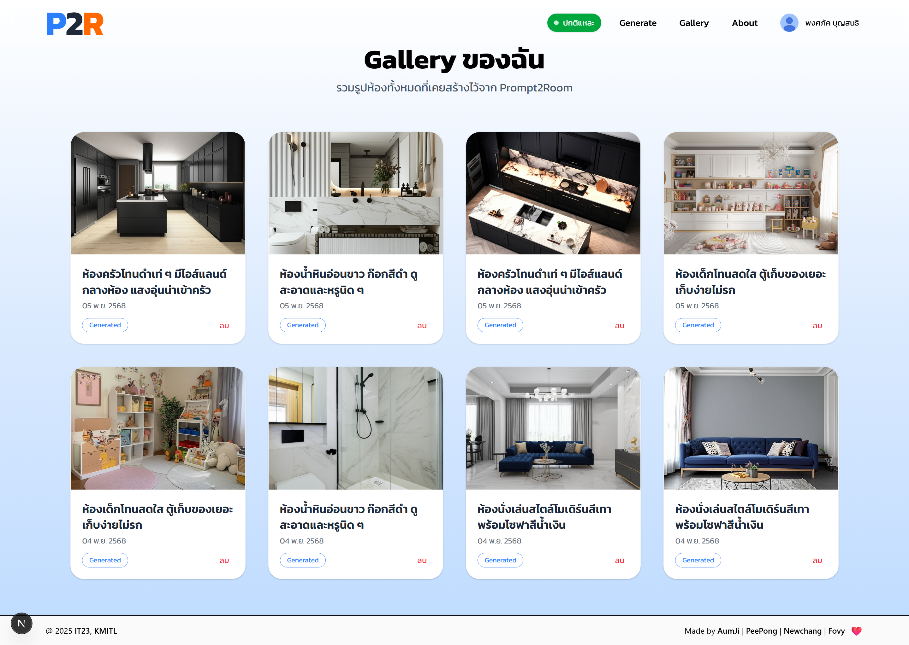
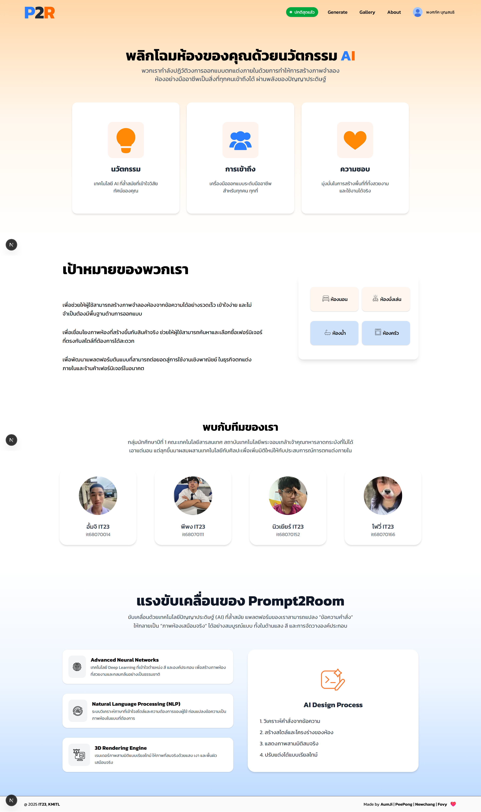

# Prompt2Room
**เว็บแอปพลิเคชันสร้างภาพห้องจากข้อความบรรยาย (Prompt) ด้วย AI**  
ผู้ใช้สามารถพิมพ์ข้อความ เช่น “ห้องนั่งเล่นสไตล์มินิมอล” แล้วระบบจะสร้างภาพจำลองห้องตามสไตล์ที่ต้องการได้ภายในไม่กี่วินาที

---

## 👨‍💻 ทีมผู้พัฒนา

| ชื่อ | รหัสนักศึกษา |
|------|---------------|
| นายจิรภัทร วิชัยดิษฐ์ | 68070014 |
| นายพงศภัค บุญสนธิ | 68070111 |
| นายยศกร ประหาญภาพ | 68070152 |
| นางสาววธูพิตราพร เดชชัง | 68070166 |

---

## 🧰 สิ่งที่ต้องมีในเครื่อง
- [Node.js](https://nodejs.org/)
- [Python 3.10+](https://www.python.org/)
- [Git](https://git-scm.com/)

---

## 🖼️ ตัวอย่างหน้าเว็บ

### หน้า Main


### หน้า Generate


### หน้า Gallery


### หน้า About



---

## ⚙️ การติดตั้งและใช้งาน

### 1 ติดตั้ง Frontend
```bash
cd frontend

# ติดตั้ง dependencies (ทำครั้งแรกเท่านั้น)
npm install

# รันหน้าเว็บ
npm run dev
```

### 2 ติดตั้ง Frontend
```bash
# สร้าง virtual environment (ทำครั้งแรก)
python3 -m venv env # macOS / Linux
python -m venv env # Windows

# เปิดใช้งาน env
source env/bin/activate # macOS / Linux
venv\Scripts\activate   # Windows

# ติดตั้ง dependencies
pip install -r requirements.txt

# รันเซิร์ฟเวอร์
uvicorn backend.main:app --reload
```
### RUN WEB แบบเคยติดตั้งแลัว
```bash
cd frontend
npm run dev

cd ..
source venv/bin/activate   # สำหรับ macOS/Linux
venv\Scripts\activate      # สำหรับ Windows
uvicorn backend.main:app --reload
```
